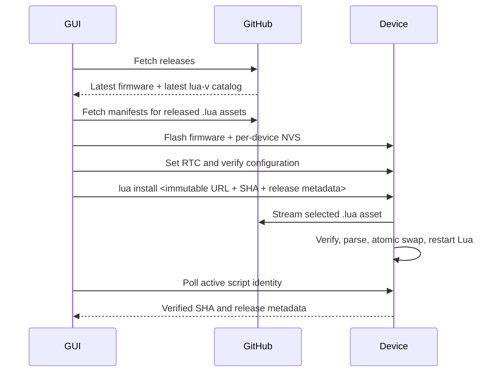

# ambyte on-boarding GUI

Cross-platform (Windows / Linux / macOS) Tkinter tool that flashes and
provisions ambyte boards in one click per device. It replaces the manual
`flash/flash.cmd` bundle flow for operator on-boarding sessions.

```
python -m pip install -r flash_gui/requirements.txt
python -m flash_gui        # from the repo root
```

## Prebuilt executables

CI (`.github/workflows/flash-gui-build.yml`) builds standalone executables for
Windows, Linux and macOS with PyInstaller — no Python install needed on the
operator's machine:

- every PR touching `flash_gui/**` builds them once as workflow artifacts,
  keyed by the PR head SHA (30-day retention, GitHub login required);
- the merge to `main` waits for that PR run, downloads and verifies those exact
  artifacts, signs the Windows bundle if signing is configured, and publishes
  them as a public GitHub release. Nothing is rebuilt at release time, so the
  bytes users download are the bytes CI tested on the PR.

**Every merge to `main` cuts a release.** There is no manual tag step. The tag
is patch-incremented from the highest existing `flash-gui-v*` tag, so merging a
GUI change is the whole release process. Releases are always marked
`prerelease` and never `latest`, so `/releases/latest` keeps resolving to the
newest *firmware* release. The flash GUI belongs to **no** semantic-release
unit, and `flash_gui/**` commits never bump the firmware version
(`tools/release/path-scoped.js`).

If you need a minor or major bump rather than a patch, create the tag by hand
before merging and CI will continue from it.

Release assets are one zip per platform (`*-windows.zip`, `*-linux.zip`,
`*-macos.zip`), each holding a PyInstaller `--onedir` bundle. Unzip it and run
`ambyte-flash-gui` from inside the extracted folder; the folder must stay
intact, since the executable loads its Python runtime from its siblings.

Every release also ships a `SHA256SUMS` asset. Verify before running:

```bash
sha256sum -c SHA256SUMS --ignore-missing   # Linux
shasum -a 256 -c SHA256SUMS --ignore-missing   # macOS
```

```powershell
Get-FileHash .\ambyte-flash-gui-windows.zip -Algorithm SHA256   # Windows
```

### Antivirus false positives

Windows builds are **not code-signed**, and Microsoft Defender misclassifies
them, most often as `Trojan:Win32/Sabsik.TE.A!ml` (first seen 2026-08-17 on
`flash-gui-v0.2.1`). It is a false positive driven by three things at once: no
signature, near-zero download prevalence, and a program that opens USB serial
ports and writes certificates. The verdict depends on the machine's
cloud-protection level, so it fires for some operators and not others on
byte-identical files.

If it trips, in Windows Security open Protection history, find the entry, and
choose **Allow** (or **Restore** then **Allow on device**). On a managed laptop
where that is greyed out, add a folder exclusion under Manage settings and
re-download into it. Check `SHA256SUMS` first. Do not disable real-time
protection.

CI does what it can without a certificate: `--onedir` instead of `--onefile`
(no PE payload unpacked to `%TEMP%` at runtime), and a real Win32 version
resource with CompanyName/ProductName/FileDescription instead of a blank PE
(`build_version_info.py`). Both lower the score; neither is a fix.

The only durable fix is an Authenticode signature, and every route to one has a
price:

| Route | Cost | Blocker |
| --- | --- | --- |
| Azure Artifact Signing | ~$10/month | wired into the release job already, gated on the `AZURE_SIGNING_ENDPOINT` Actions variable, so it starts working the moment that variable is set |
| SignPath Foundation | free | needs an OSI-approved licence for *all* components; `flash_gui/` is now GPL-3.0 but the firmware alongside it is CERN-OHL-S-2.0, so this only becomes viable if the GUI moves to its own repo. The cert also names SignPath Foundation as publisher, not JII |
| Certum open-source cert | ~EUR 30/year | hardware token, so it cannot sign from a hosted runner |
| Microsoft submission portal | free | keyed to one file hash, so it has to be redone every build |

macOS builds are not notarized either: expect the Gatekeeper right-click-Open
dance.

### The Lua script is pushed, not downloaded

The GUI streams the selected script down the console it already holds open
(`lua begin` / `lua put` / `lua commit`), so **the board needs no network to be
onboarded**. The bytes are cached and digest-checked on the PC; the firmware
re-hashes what it received, syntax-checks it, and keeps the previous script as
`main.lua.bak`, exactly as it does for a remote install.

Chunks are base64 and 144 bytes each, giving a 200-character command line. The
binding limit is **not** the console's 512-byte `max_cmdline_length` but the
USB-Serial-JTAG driver's 256-byte `rx_buffer_size`, which ESP-IDF fixes and the
REPL does not expose; a longer line is swallowed and the command never answers.
Measured on hardware: a 224-character line works, 264 hangs. Each `lua put`
replies with the staged file's own size, so a dropped chunk is caught as it
happens rather than at the final digest check.

If the board runs firmware older than these commands, the GUI says so and falls
back to the old behaviour of asking the device to download the script itself.
That fallback is the only path that needs the board on Wi-Fi.

### GitHub rate limits

The GUI reads the repo's release list to find the firmware and the Lua catalog.
Unauthenticated GitHub allows **60 requests/hour per IP**, and an office behind
one NAT shares that budget across every operator.

The listing is fetched once and shared by both lookups, cached on disk for five
minutes, and revalidated with `If-None-Match` after that; GitHub does not count
a `304 Not Modified` against the limit, so repeated starts are effectively free.
If the limit is hit anyway, or GitHub is unreachable, the last cached listing is
used and the reason is logged rather than blocking the session, and the error
names the time the window resets.

To raise the ceiling to 5000/hour, set `GH_TOKEN` (or `GITHUB_TOKEN`) to a
GitHub personal access token before launching. The repo is public, so the token
needs **no scopes at all**.

The executables bundle Mozilla's CA root store through `certifi`; HTTPS does
not depend on Python's build-machine certificate paths existing on the
operator's computer. Platform roots are retained as well, so managed machines
can continue to trust locally installed proxy certificates.

## Operator flow (10 boards in a row)

Once per session:

1. Pick the **environment** (dev / prod).
2. Click **Sign in (API key)** — a browser opens on the openJII *API keys*
   page; create a key there (shown once, `jii_...`) and paste it into the
   dialog. The key is validated and remembered per environment.
3. Pick the **experiment** from the dropdown (active experiments you are a
   member of). The **MQTT topic root** is pre-filled from it and stays
   editable; `{thingName}` is replaced per board.
4. Pick the **Lua script**. The GUI always loads the newest stable `lua-v*`
   catalog and lists the released `.lua` files it contains; `main.lua` is the
   default when available.
5. Enter the **Wi-Fi SSID/password** the boards should join.

Per board: plug it in via USB-C → **Refresh** → pick the port → **On-board
device** → confirm/edit the name in the prompt. Everything else is automatic,
and the procedure ends with an explicit per-item PASS/FAIL (name, timezone,
RTC, selected Lua script).

## What one procedure does

1. **Pre-flash check** — 2 s console probe (one retry) for a running ambyte
   firmware and its stored name; falls back to reading the MAC with esptool
   (works on unflashed chips). The name prompt is pre-filled with the stored
   name, else `AMBYTE_<MAC>`.
2. **openJII registration + certificate** — registers the MAC as an `ambyte`
   device (or re-uses the existing registration), issues — or rotates, when a
   live cert exists — its X.509 credentials. The show-once private key is
   written to disk *before* anything else can fail
   (`<config>/device_certs/<thing>/`). This happens **before** flashing, so an
   API failure leaves the board untouched.
3. **NVS bake** — a per-board provisioning image: device name, IANA timezone
   (from this PC's clock), `flash_time` RTC seed, the board's own cert + key +
   Amazon Root CA 1, Wi-Fi credentials, MQTT broker (per environment), client
   id = openJII Thing name (required by the AWS IoT policy), topic root,
   command/status topics.
4. **Flash** — the latest GitHub release (`ambyte-iot-v*.zip`, cached locally,
   version shown in the GUI) + the NVS image, offsets from the release's own
   `flasher_args.json`. Only those regions are written — field data in
   coredump/littlefs/storage survives. A mid-way failure leaves the chip in
   the ROM bootloader (re-flashable) and enables **Retry flash**.
5. **RTC** — waits up to three minutes for the freshly booted console (normally
   20–35 s, but SD recovery can take longer and the USB port may re-enumerate),
   keeping one serial handle open so polling cannot repeatedly reset the board,
   then sets the exact current UTC epoch with `rtc set` (applies immediately).
6. **Lua script** — asks the firmware to stream the selected immutable release
   asset to the SD card. The firmware checks SHA-256 and Lua syntax, keeps the
   previous file as `/sdcard/main.lua.bak`, atomically installs it as
   `/sdcard/main.lua`, and restarts Lua in place. Verification keeps the same
   serial connection open while this asynchronous operation completes.
7. **Verify** — reads back `cfg get device_name`, `cfg get timezone`, `rtc`,
   and the active Lua file identity, then reports PASS/FAIL per item. On
   failure, **Retry provisioning** repairs name/timezone and retries the Lua
   install over the console — never a re-flash.

### Onboarding sequence



## Design notes / firmware facts this tool relies on

- Certificates and Wi-Fi credentials have **no console path** in the firmware
  (the cert setters are dead code; `wifi_join` doesn't set the provisioned
  flag) — NVS baking at 0x9000 (`0x6000` bytes, matches `partitions.csv`) is
  the provisioning protocol. The NVS generator is vendored
  (`vendor/nvs_partition_gen.py`, from ESP-IDF), so no IDF install is needed.
- `cfg get` returns **raw NVS strings**: a fleet-default board answers
  `device_name = AMBYTE_{MAC}` — the tool expands the token before comparing.
- The MQTT client id **must equal the openJII Thing name**
  (`ambyte_<MAC>`): the platform IoT policy renders identity-bound resources
  as `${iot:Connection.Thing.ThingName}`, which AWS only resolves when they
  match.
- The device timezone table is fixed (`components/timezone/timezone.c`); the
  GUI warns when this PC's zone is not in it (scheduling then falls back to a
  fixed UTC offset on the device).
- openJII auth: the API exposes **no password login and no OAuth device
  flow**; the supported desktop flow is a personal **API key** sent as
  `x-api-key`. Device-registry endpoints are additionally gated by the
  `iot-devices` feature flag per user — a 403 means the flag is off for your
  account.
- The AWS IoT broker endpoints in `config.py` are account-specific and not
  discoverable via any openJII API; they were resolved with
  `aws iot describe-endpoint --endpoint-type iot:Data-ATS` against each
  account. If an environment's endpoint ever changes, update it there — the
  GUI refuses to start a procedure for an environment whose endpoint is unset.
- Firmware and Lua are independent release streams. The GUI scans the release
  feed separately for the newest stable firmware `vX.Y.Z` flash bundle and the
  highest stable `lua-vX.Y.Z` catalog, so a Lua or GUI release can never be
  mistaken for firmware.

## Files

```
flash_gui/
  __main__.py        python -m flash_gui
  gui.py             Tkinter app (worker threads, never blocks the UI)
  procedure.py       the per-board state machine + retry paths
  config.py          environments, topic conventions, persisted settings
  release_fetch.py   firmware download/cache + latest Lua catalog validation
  nvs_builder.py     per-board NVS image (identity/certs/Wi-Fi/RTC seed)
  esptool_ops.py     esptool>=5 scripting API (read MAC, flash, NVS-only)
  ambyte_serial.py   firmware console client (probe / cfg / rtc / verify)
  openjii_client.py  API-key auth, experiments, device registry, credentials
  timezones.py       host IANA zone + the firmware's supported-zone table
  vendor/            vendored ESP-IDF nvs_partition_gen.py
  tests/             pure-logic unit tests (no hardware/network)
```

Settings, release cache and issued certificates live in the per-user config
dir (`%APPDATA%\ambyte-flash-gui` on Windows, `~/.config/ambyte-flash-gui` on
Linux, `~/Library/Application Support/ambyte-flash-gui` on macOS). The API key
and Wi-Fi password are stored there in plain text with owner-only permissions
— treat that directory as sensitive.

## License

GPL-3.0, matching [openJII](https://github.com/Jan-IngenHousz-Institute/open-jii).
See [LICENSE.GPL-3.0](../LICENSE.GPL-3.0). The firmware alongside this directory
is CERN-OHL-S-2.0 instead; the repo root README has the full split.

The packaged executables bundle esptool (GPL-2.0-or-later), pyserial (BSD),
tzlocal (MIT) and certifi (MPL-2.0), so the shipped bundle is GPL-3.0 as a
combined work.
